# Overlay Sidebar Implementation Method for Future Use

## Overview

This document describes the implementation method for the overlay sidebar script in Tavern Helper. It provides a reusable pattern for creating overlay UI components that integrate with SillyTavern's script system.

## Architecture

The implementation follows a modular architecture with clear separation of concerns:

```mermaid
graph TD
    A[index.ts] --> B[加载和卸载时执行函数.ts]
    B --> C[sidebar-logic.ts]
    B --> D[notes-storage.ts]
    C --> E[UI Injection]
    C --> F[Toggle Logic]
    D --> G[LocalStorage]
    E --> H[CSS/HTML]
    F --> I[Global API]
    G --> J[Auto-save]
```



## Components

### 1. Entry Point (`index.ts`)

```typescript
import './notes-storage';
import './sidebar-logic';
import './加载和卸载时执行函数';
```

**Purpose**: Simple imports that trigger the script modules to load.

**Design Pattern**: Use side‑effect imports to keep the entry point minimal.

### 2. Load/Unload Handler (`加载和卸载时执行函数.ts`)

**Responsibilities**:
- Initialize the sidebar when the script loads
- Setup event listeners
- Register with Tavern Helper's script panel system
- Cleanup on script unload or chat changes

**Key Functions**:
- `$(() => { ... })` – DOM ready handler
- `replaceScriptButtons()` – Adds button to script panel
- `eventOn()` – Registers button click handler
- `$(window).on('pagehide')` – Unload cleanup
- `syncNotesToVariable()` – Immediate variable sync for macro updates

**Example**:
```typescript
$(() => {
    initializeSidebar();
    setupAutoSave();
    replaceScriptButtons([
        { name: '📝 Quick Notes', visible: true }
    ]);
    eventOn(getButtonEvent('📝 Quick Notes'), () => {
        window.toggleSidebar?.();
    });
});
```

### 3. Sidebar Logic (`sidebar-logic.ts`)

**Responsibilities**:
- Inject CSS styles into the page
- Inject HTML sidebar structure
- Manage sidebar visibility state
- Provide global API functions for toggle/show/hide
- Cleanup injected elements

**Global API**:
```typescript
declare global {
    interface Window {
        toggleSidebar(): void;
        hideSidebar(): void;
        showSidebar(): void;
    }
}
```

**Key Functions**:
- `injectCSS()` – Injects CSS styles with teleportStyle support
- `injectHTML()` – Creates sidebar DOM elements
- `toggleSidebar()` – Toggles visibility with animation
- `setupEventListeners()` – Handles close button, escape key, blur events
- `cleanupSidebar()` – Removes all injected elements and styles

**CSS Injection Pattern**:
```typescript
function injectCSS(): void {
    const css = `...`;
    $('<style>').text(css).appendTo('head');
    teleportStyle(); // For iframe compatibility
}
```

**HTML Injection Pattern**:
```typescript
function injectHTML(): void {
    if ($(`#${SIDEBAR_ID}`).length > 0) return;
    const html = `...`;
    $(html).appendTo('body');
}
```

### 4. Notes Storage (`notes-storage.ts`)

**Responsibilities**:
- Save/load notes to localStorage with chat‑specific keys
- Auto‑save on textarea input
- Provide global functions for save/load

**Storage Key Pattern**:
```typescript
function getStorageKey(): string {
    let chatId = 'global';
    if (window.SillyTavern?.getCurrentChatId) {
        const id = window.SillyTavern.getCurrentChatId();
        if (id !== undefined && id !== null) {
            chatId = `chat_${id}`;
        }
    }
    return `tavern_helper_quick_notes_${chatId}`;
}
```

**Global Functions**:
```typescript
window.saveCurrentNotes = function() {
    const content = $('#tavern-helper-notes').val() as string;
    saveNotes(content);
    toastr.success('Notes saved!', 'Quick Notes');
};

window.loadNotes = function() {
    return loadNotes();
};
```

**Auto‑save Implementation**:
```typescript
export function setupAutoSave(): void {
    $(document).on('input', '#tavern-helper-notes', function() {
        if (!currentConfig.enabled) return;
        
        // Immediate sync to tavern variables for macro accessibility
        const content = $(this).val() as string;
        if (typeof window.syncNotesToVariable === 'function') {
            window.syncNotesToVariable(content);
        }
        
        // Debounced localStorage save for performance
        if (autoSaveTimeout) clearTimeout(autoSaveTimeout);
        autoSaveTimeout = window.setTimeout(() => {
            saveNotes(content);
        }, currentConfig.delay);
    });
}
```

## Integration Points

### 1. Tavern Helper Script Panel
```typescript
replaceScriptButtons([
    { name: '📝 Quick Notes', visible: true }
]);
eventOn(getButtonEvent('📝 Quick Notes'), callback);
```

### 2. SillyTavern Chat Context
```typescript
if (typeof tavern_events !== 'undefined') {
    eventOn(tavern_events.CHAT_CHANGED, () => {
        // Handle chat change
    });
}
```

### 3. Global Window API
Global functions are attached to `window` for inline handler compatibility:
```html
<button onclick="window.toggleSidebar()">Toggle</button>
```

## Style Guidelines

### CSS Structure
- Use `rgba()` with backdrop‑filter for modern translucent effect
- High `z-index` (999999) to overlay on top of SillyTavern UI
- Smooth `transform` transitions for animations
- Dracula‑inspired color palette for consistency with SillyTavern

### Responsive Considerations
- Fixed positioning (`position: fixed`)
- Viewport‑relative dimensions (`height: 100vh`, `width: 300px`)
- Adjust padding and font sizes for readability

## Error Handling

### Safe LocalStorage Operations
```typescript
try {
    localStorage.setItem(getStorageKey(), content);
    console.log(`[Tavern Helper] Notes saved for ${getStorageKey()}`);
} catch (e) {
    console.error('[Tavern Helper] Failed to save notes:', e);
}
```

### Graceful Degradation
- Check for `window.SillyTavern` existence before calling its methods
- Provide fallback to global storage if chat ID is unavailable
- Use optional chaining when accessing potentially undefined APIs

## Performance Optimizations

### 1. DOM Query Caching
```typescript
const sidebar = $(`#${SIDEBAR_ID}`); // Cache reference for reuse
```

### 2. Debounced Auto‑save
1‑second timeout prevents excessive localStorage writes during rapid typing.

### 3. Idempotent Injection
```typescript
if ($(`#${SIDEBAR_ID}`).length > 0) {
    return;
}
```
Prevents duplicate element injection.

### 4. Cleanup on Unload
Removes all injected elements, styles, and event listeners to prevent memory leaks.

## Testing Patterns

### Manual Testing Checklist
1. Script loads without console errors
2. Button appears in script panel
3. Sidebar toggles visible/hidden on button click
4. Notes persist across page reloads
5. Chat‑specific notes isolation works
6. Auto‑save triggers after typing
7. Escape key closes sidebar
8. Cleanup occurs on page unload

### Console Commands for Debugging
```javascript
// Check if functions are available
window.toggleSidebar();
window.loadNotes();

// Inspect storage
localStorage.getItem('tavern_helper_quick_notes_chat_1');

// Trigger manual save
window.saveCurrentNotes();
```

## Example Usage

### As a User
1. **Enable Script**: In SillyTavern, go to Scripts panel and enable "Overlay Sidebar"
2. **Toggle Sidebar**: Click the 📝 Quick Notes button in the script panel
3. **Take Notes**: Type notes in the textarea – they auto‑save every second
4. **Close Sidebar**: Click the × button or press Escape
5. **Access Later**: Notes persist per chat and reload when you reopen the sidebar

### As a Developer

**Basic Integration**:
```typescript
// Import the sidebar module to add it to your script
import './overlay-sidebar';
```

**Programmatic Control**:
```typescript
// Show sidebar
window.showSidebar?.();

// Hide sidebar
window.hideSidebar?.();

// Save notes manually
if (typeof window.saveCurrentNotes === 'function') {
    window.saveCurrentNotes();
}

// Load notes
const notes = window.loadNotes?.();
```

**Extending Storage**:
```typescript
// Add custom storage provider
import { saveNotes, loadNotes } from './overlay-sidebar/notes-storage';

// Save with custom key
function saveToCustomKey(key: string, content: string) {
    localStorage.setItem(`custom_notes_${key}`, content);
}

// Load from custom key
function loadFromCustomKey(key: string): string {
    return localStorage.getItem(`custom_notes_${key}`) || '';
}
```

### As a Script Author (Creating Similar Components)

**Minimal Overlay Example**:
```typescript
// component-logic.ts
export function createOverlay(id: string, title: string) {
    const css = `
        .${id} {
            position: fixed;
            top: 0;
            right: 0;
            width: 300px;
            height: 100vh;
            background: rgba(30,30,46,0.95);
            z-index: 999999;
            transform: translateX(100%);
            transition: transform 0.3s ease;
        }
        .${id}.visible { transform: translateX(0); }
    `;
    
    $('<style>').text(css).appendTo('head');
    
    const html = `
        <div id="${id}" class="${id}">
            <h3>${title}</h3>
            <button class="close-btn">×</button>
            <div class="content"></div>
        </div>
    `;
    
    $(html).appendTo('body');
}
```

## Extension Points

### Customization Options
1. **Width Configuration**: Make sidebar width configurable via settings
2. **Position Options**: Support left/right/top/bottom positioning
3. **Theme Support**: Add light/dark theme variants
4. **Additional Features**: Markdown rendering, tags, search

### Settings Structure
```typescript
interface SidebarSettings {
    width: number;
    position: 'left' | 'right';
    theme: 'dark' | 'light' | 'auto';
    autoSaveInterval: number;
}
```

## Build Integration

### TypeScript Configuration
Ensure `tsconfig.json` includes:
```json
{
    "compilerOptions": {
        "module": "ESNext",
        "target": "ES2020",
        "strict": true
    }
}
```

### Webpack Entry
```javascript
entry: {
    'overlay-sidebar': './src/scripts/overlay-sidebar/index.ts'
}
```

## Integration Guidance

### Adding to Tavern Helper Template
1. **Copy Directory**: Copy `src/scripts/overlay-sidebar/` to your project
2. **Update Imports**: Ensure relative paths work in your project structure
3. **Register Script**: Add the script to your Tavern Helper configuration
4. **Build**: Run `npm run build` or `pnpm build` to compile

### Integration with Existing Scripts
```typescript
// In your existing script's main file
import './overlay-sidebar';

// The sidebar will automatically:
// 1. Add its button to the script panel
// 2. Initialize when DOM is ready
// 3. Clean up when script is disabled
```

### Custom Button Placement
If you want the toggle button elsewhere:
```typescript
// Create custom button
$('<button>', {
    text: 'My Notes',
    click: () => window.toggleSidebar?.()
}).appendTo('#custom-toolbar');
```

## Troubleshooting

### Common Issues

| Issue | Possible Cause | Solution |
|-------|---------------|----------|
| Sidebar not appearing | z‑index too low | Increase z‑index above 100000 |
| Button not in panel | `replaceScriptButtons` not called | Ensure DOM ready before calling |
| Notes not saving | localStorage disabled | Check browser privacy settings |
| Style conflicts | SillyTavern CSS specificity | Use more specific selectors |
| Animation jank | Hardware acceleration | Add `will‑change: transform` |

### Debugging Steps
1. Open browser developer tools
2. Check Console for error messages
3. Inspect Elements tab for injected HTML/CSS
4. Verify localStorage keys in Application tab
5. Use Network tab to ensure script loaded

## Best Practices for Future Implementations

1. **Modular Design**: Keep logic separated by concern (UI, storage, integration)
2. **Global API**: Attach functions to `window` for inline handler compatibility
3. **Teleport Style**: Use `teleportStyle()` for iframe‑safe CSS injection
4. **Chat‑aware Storage**: Always scope storage by chat ID when possible
5. **Cleanup on Unload**: Remove everything added to avoid memory leaks
6. **Defensive Programming**: Check for API existence before calling
7. **Consistent Logging**: Use `[Tavern Helper]` prefix for console messages
8. **User Feedback**: Provide toastr notifications for important actions

## Example: Creating a New Overlay Component

Follow this template for new overlay components:

1. **Create module structure**:
   ```
   src/scripts/your-component/
   ├── index.ts
   ├── load-unload.ts
   ├── component-logic.ts
   └── storage.ts (optional)
   ```

2. **Copy integration pattern**:
   - Use same DOM ready handler
   - Register with `replaceScriptButtons`
   - Implement global toggle functions

3. **Adapt CSS/HTML**:
   - Update CSS with your component's styles
   - Modify HTML structure for your UI
   - Keep the same overlay positioning pattern

4. **Add to build configuration**:
   - Update webpack entries
   - Ensure TypeScript compilation
```

## License
This implementation is part of Tavern Helper template and follows the same MIT license as the main project.